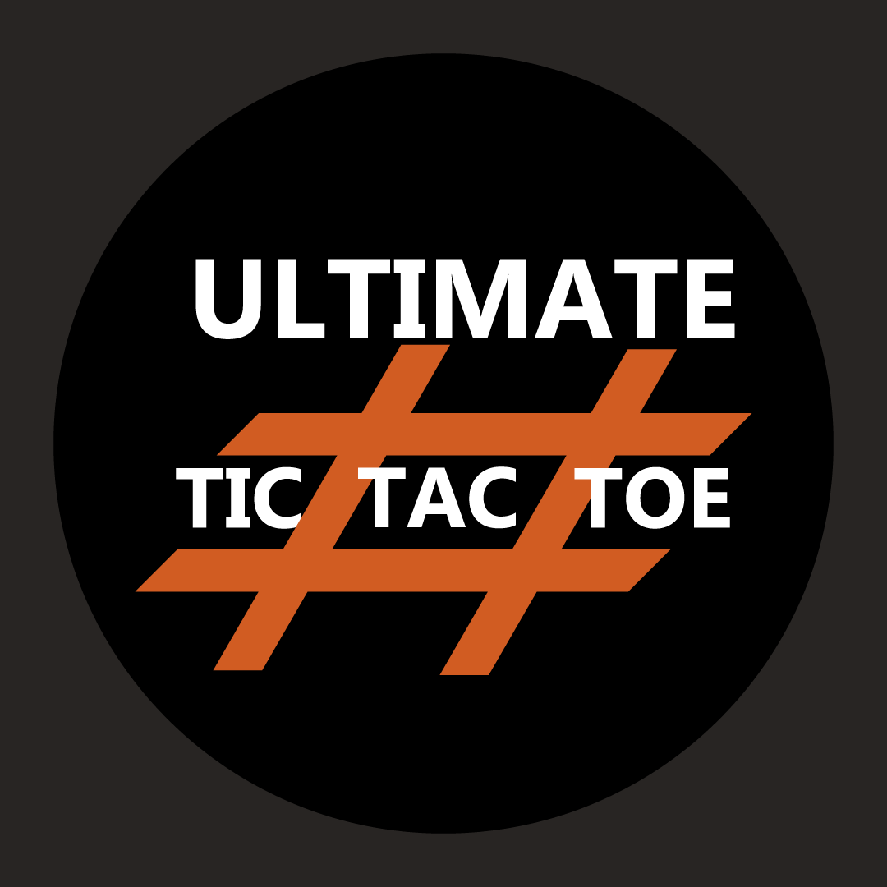

# **UltimateTicTacToe**
## Created by Team Tic-Tac & Co
### *by the combined efforts of DJ Morel, Hang Liu, Hussain Valiuddin, Mari Tsunoda, William Willigrod*

# Motivation
We created this app as part of our EC 327 (Intro to Software Engineering) final project at BU. The Motivation behind this app was to take the simple and fun game from our childhood, Tic-Tac-Toe and to create a more strategic and competitive version of the game whoch can be used by adults as well.

The game has a single and multiplayer version of the game where a 

# ScreenShoots

# Features
The game has both single player and multiplayer options. There is a sweet tune playing in the background during each game as well. The game has a confirm move button to prevent accidental moves which can occur when playing on smaller screens. 
For new users, the game also has a How To Play manual which explains the rules which are pretty simple and build upon the rules of regular Tic-Tac-Toe.

# Code Example

# Installation
###The app is available on playstore through the link :
###You can also download the app from github.
-Download Git (https://git-scm.com/downloads)
-Open Android Studio
-Check out project from Version Control > Git
-Copy the GitHub repository URL and paste it into the URL pop up
-Click on Test
-Click on Clone
-Import Project from External Source and finish

# Tests

# How to use?

Android Studio Project
